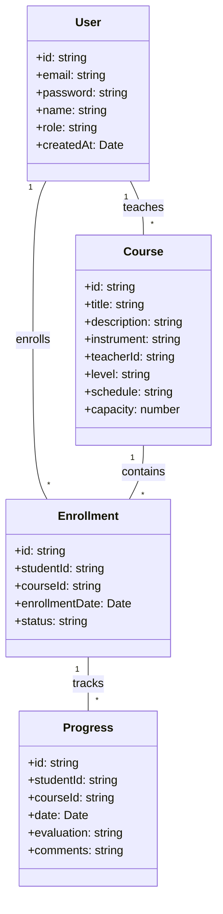

# TP Next.js - Système de Gestion d'École de Musique (MusiLearn)

## Contexte
Une école de musique souhaite moderniser sa gestion administrative en créant une application web permettant aux professeurs de gérer leurs cours et aux élèves de suivre leur progression.

## Objectifs Pédagogiques
- Mettre en place une application Next.js complète
- Implémenter l'authentification et l'autorisation
- Créer des interfaces responsives avec Tailwind CSS
- Gérer les données avec Server Actions
- Utiliser les layouts et le routing
- Implémenter des formulaires avec validation
- Optimiser les performances avec le streaming
- Gérer les métadonnées pour le SEO

## Structure de la Base de Données



## Fonctionnalités Requises

### 1. Authentification
- Système de connexion avec email/mot de passe via NextAuth.js
- Gestion des rôles (Admin, Professeur, Élève)
- Protection des routes selon les rôles
- Page de connexion personnalisée

### 2. Interface Professeur
- Dashboard avec vue d'ensemble des cours
- Gestion des cours (CRUD)
- Suivi des élèves
- Évaluation des progrès

### 3. Interface Élève
- Inscription aux cours
- Consultation des évaluations
- Suivi de la progression
- Historique des cours

### 4. Administration
- Gestion des utilisateurs
- Attribution des cours
- Rapports et statistiques

## Spécifications Techniques

### Layout et Structure
```plaintext
/app
  /layout.tsx         # Layout principal
  /(auth)
    /login/page.tsx
    /register/page.tsx
  /(dashboard)
    /layout.tsx       # Layout dashboard
    /teacher
      /courses/page.tsx
      /students/page.tsx
      /evaluations/page.tsx
    /student
      /courses/page.tsx
      /progress/page.tsx
    /admin
      /users/page.tsx
      /reports/page.tsx
```

### Composants Requis
1. Navigation responsive
2. Tableaux de données avec pagination
3. Formulaires avec validation
4. Cards pour l'affichage des cours
5. Graphiques de progression
6. Modal de confirmation

### Server Actions
Implémenter les actions suivantes :
```typescript
// Cours
createCourse(formData: FormData)
updateCourse(id: string, formData: FormData)
deleteCourse(id: string)

// Inscriptions
enrollStudent(courseId: string, studentId: string)
updateEnrollmentStatus(id: string, status: string)

// Évaluations
submitEvaluation(studentId: string, formData: FormData)
```

### Styles et UI
- Utiliser Tailwind CSS pour le style
- Créer une interface responsive
- Implémenter un thème cohérent
- Utiliser les composants shadcn/ui

### Validation et Sécurité
- Validation côté client et serveur avec Zod
- Protection CSRF
- Gestion des erreurs
- Messages de feedback utilisateur

### SEO et Métadonnées
```typescript
// Exemple de configuration métadonnées
export const metadata = {
  title: {
    template: '%s | MusiLearn',
    default: 'MusiLearn - École de Musique'
  },
  description: 'Plateforme de gestion de cours de musique',
  keywords: ['musique', 'cours', 'apprentissage'],
  authors: [{ name: 'MusiLearn' }],
  openGraph: {
    images: '/images/og-image.jpg',
  },
}
```

## Bonus et Améliorations Possibles
1. Système de notifications en temps réel
2. Calendrier interactif des cours
3. Upload de fichiers (partitions, enregistrements)
4. Chat intégré professeur-élève
5. Mode sombre/clair
6. Export des évaluations en PDF

## Critères d'Évaluation
1. **Architecture et Organisation (20%)**
   - Structure du projet
   - Organisation du code
   - Utilisation des patterns React/Next.js

2. **Fonctionnalités (30%)**
   - Implémentation complète du CRUD
   - Gestion des rôles
   - Validation des données

3. **Interface Utilisateur (20%)**
   - Design responsive
   - Expérience utilisateur
   - Accessibilité

4. **Performance et Optimisation (15%)**
   - Temps de chargement
   - Optimisation des images
   - Utilisation du streaming

5. **Sécurité et Bonnes Pratiques (15%)**
   - Sécurisation des routes
   - Gestion des erreurs
   - Qualité du code

## Livrables Attendus
1. Code source sur GitHub
2. Documentation d'installation
3. Guide utilisateur basique
4. Présentation des choix techniques
5. Déploiement sur Vercel